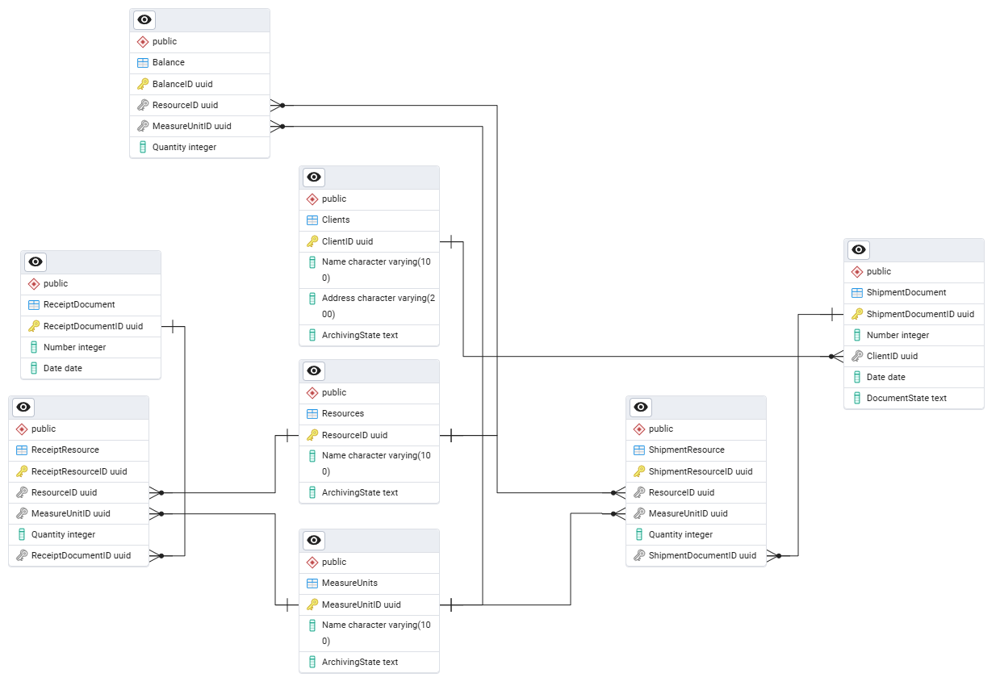

## Содержание

- [Что это за проект?](#что-это-за-проект)
- [База данных](#база-данных)
- [API endpoints](#api-endpoints)
  - [Resources](#resources)
    - [1. Получение списка ресурсов](#1-получение-списка-ресурсов)
    - [2. Получение списка активных ресурсов](#2-получение-списка-активных-ресурсов)
    - [3. Получение списка архивных ресурсов](#3-получение-списка-архивных-ресурсов)
    - [4. Получение ресурса по id](#4-получение-ресурса-по-id)
    - [5. Создание ресурса](#5-создание-ресурса)
    - [6. Архивация ресурса](#6-архивация-ресусра)
    - [7. Разархивация ресурса](#7-разархивация-ресурса)
    - [8. Обновление ресурса](#8-обновление-ресурса)
    - [9. Удаление ресурса](#9-удаление-ресурса)
  - [Measure units](#measure-units)
    - [1. Получение списка единиц измерения](#1-получение-списка-единиц-измерения)
    - [2. Получение списка активных единиц измерения](#2-получение-списка-активных-единиц-измерения)
    - [3. Получение списка архивных единц измерения](#3-получение-списка-архивных-единц-измерения)
    - [4. Получение единицы измерения по id](#4-получение-единицы-измерения-по-id)
    - [5. Создание единицы измерения](#5-создание-единицы-измерения)
    - [6. Архивация единицы измерения](#6-архивация-единицы-измерения)
    - [7. Разархивация единицы измерения](#7-разархивация-единицы-измерения)
    - [8. Обновление единицы измерения](#8-обновление-единицы-измерения)
    - [9. Удаление единицы измерения](#9-удаление-единицы-измерения)
  - [Clients](#clients)
    - [1. Получение списка клиентов](#1-получение-списка-клиентов)
    - [2. Получение списка активных клиентов](#2-получение-списка-активных-клиентов)
    - [3. Получение списка архивных клиентов](#3-получение-списка-архивных-клиентов)
    - [4. Получение клиента по id](#4-получение-клиента-по-id)
    - [5. Создание клиента](#5-создание-клиента)
    - [6. Архивация клиента](#6-архивация-клиента)
    - [7. Разархивация клиента](#7-разархивация-клиента)
    - [8. Обновление клиента](#8-обновление-клиента)
    - [9. Удаление клиента](#9-удаление-клиента)
  - [Balance](#balance)
    - [1. Получение списка баланса](#1-получение-списка-баланса)
    - [2. Получение списка баланса по фильтру](#2-получение-списка-баланса-по-фильтру)
  - [Receipts](#receipts)
    - [1. Получение списка документов поступления](#1-получение-списка-документов-поступления)
    - [2. Получение списка документов поступления с ресурсами](#2-получение-списка-документов-поступления-с-ресурсами)
    - [3. Получение конкретного документа поступления по id с ресурсами](#3-получение-конкретного-документа-поступления-по-id-с-ресурсами)
    - [4. Создание документа поступления](#4-создание-документа-поступления)
    - [5. Создание ресурса поступления](#5-создание-ресурса-поступления)
    - [6. Обновление документа поступления](#6-обновление-документа-поступления)
    - [7. Удаление документа поступления](#7-удаление-документа-поступления)
    - [8. Удаление ресурса поступления](#8-удаление-ресурса-поступления)
  - [Shipments](#shipments)
    - [1. Получение списка документов отгрузки](#1-получение-списка-документов-отгрузки)
    - [2. Получение списка документов отгрузки с ресурсами](#2-получение-списка-документов-отгрузки-с-ресурсами)
    - [3. Получение конкретного документа отгрузки по id с ресурсами](#3-получение-конкретного-документа-отгрузки-по-id-с-ресурсами)
    - [4. Создание документа отгрузки](#4-создание-документа-отгрузки)
    - [5. Создание ресурса отгрузки](#5-создание-ресурса-отгрузки)
    - [6. Подписание документа](#6-подписание-документа)
    - [7. Снятие подписи с документа](#7-снятие-подписи-с-документа)
    - [8. Обновление документа отгрузки](#8-обновление-документа-отгрузки)
    - [9. Удаление документа отгрузки](#9-удаление-документа-отгрузки)
    - [10. Удаление ресурса отгрузки](#10-удаление-ресурса-отгрузки)
- [Как установить и запустить проект?](#как-установить-и-запустить-проект)

# Что это за проект?

Приложение автоматизирующее (упрощенно) работу склада.

Стек используемых технологий:

- Backend:
  - C#
  - ASP.NET Core
  - Entity Framework
  - PostgreSQL
- Frontend:
  - React.js
  - HTTP-клиент Axios

Реализованные бизнесс-правила:

- Невозможно создать Ресурс, Единицу измерения, Клиента, Документ поступления и Документ отгрузки, если в системе уже существует сущность того же типа с таким наименованием/номером.
- Невозможно удалить Ресурс, Единицу измерения, Клиента, если они где-то используются, но можно перевести их в архив. Сущности в архиве невозможно выбрать при создании/редактировании документов поступления/отгрузки, если только они уже не выбраны в этом документе.
- При создании документа поступления на складе увеличивается баланс, на кол-во поступивших ресурсов. При удалении документа поступления, баланс на складе уменьшается. Так же важно чтобы баланс правильно изменялся при редактировании ресурсов поступления. Если ресурсов на складе недостаточно. То сохранить/удалить документ нельзя.
- При создании/редактировании/удалении документа отгрузки – с балансом ничего не происходит, изменения баланса происходит только когда документ отгрузки подписывается или отзывается. При подписании отгрузки баланс на складе уменьшается, при отзыве – увеличивается. Как и в случае с поступлением, подписать документ можно только в случае, если на складе достаточно ресурсов.
- Баланс «суммируется» на складе, если у него одинаковый ресурс и единица измерения.
- Документ поступления может быть пустым (т.е. не содержать в себе ресурсов), а документ отгрузки не может быть пустым.

# База данных



Реализованные сущности:

- Ресурс (идентификатор, наименование, состояние) [Resources]
- Единица измерения (идентификатор, наименование, состояние) [MeasureUnits]
- Клиент (идентификатор, наименование, адрес, состояние) [Clients]
- Баланс (идентификатор, идентификатор ресурса, идентификатор единицы измерения, количество) [Balance]
- Документ поступления (идентификатор, номер, дата) [ReceiptDocument]
- Ресурс поступления (идентификатор, идентификатор документа поступления, идентификатор ресурса, идентификатор единицы измерения, количество) [ReceiptResource]
- Документ отгрузки (идентификатор, номер, идентификатор клиента, дата, состояние) [ShipmentDocument]
- Ресурс отгрузки (идентификатор, идентификатор документа отгрузки, идентификатор ресурса, идентификатор единицы измерения, количество) [ShipmentResource]

# API endpoints

## Resources

### 1. Получение списка ресурсов

**Метод:** `GET`

**Endpoint:** `/resources`

**Описание:** Возвращает список всех ресурсов

**Ответ (200 ОК)**

```json
Respone body
[
  {
    "id": "Guid",
    "name": "string",
    "archivingState": 0
  }
]
```

`archivingState` принимает значение `0` в случае, если статус ресурса `WORKING`. Если значение `1`, то статус ресусра `ARCHIEVED`.

### 2. Получение списка активных ресурсов

**Метод:** `GET`

**Endpoint:** `/resources/active`

**Описание:** Возвращает список всех активных ресурсов

**Ответ (200 ОК)**

```json
Respone body
[
  {
    "id": "Guid",
    "name": "string",
    "archivingState": 0
  }
]
```

`archivingState` всегда будет принимать значение `0` так как статус возвращаемых ресурсов `WORKING`.

### 3. Получение списка архивных ресурсов

**Метод:** `GET`

**Endpoint:** `/resources/archived`

**Описание:** Возвращает список всех архивных ресурсов

**Ответ (200 ОК)**

```json
Respone body
[
  {
    "id": "Guid",
    "name": "string",
    "archivingState": 1
  }
]
```

`archivingState` всегда будет принимать значение `1` так как статус возвращаемых ресурсов `ARCHIEVED`.

### 4. Получение ресурса по id

**Метод:** `GET`

**Endpoint:** `/resources/{id}`

**Описание:** Возвращает конкретный ресурс

**Ответ (200 ОК)**

```json
Respone body
{
  "id": "Guid",
  "name": "string",
  "archivingState": 0
}
```

`archivingState` принимает значение `0` в случае, если статус ресурса `WORKING`. Если значение `1`, то статус ресусра `ARCHIEVED`.

**Ответ (404 Not Found)**

```json
Respone body
Resource with ID 'Guid' not found.
```

### 5. Создание ресурса

**Метод:** `POST`

**Endpoint:** `/resources`

**Описание:** Создаёт ресурс

```json
Request body
{
  "name": "string"
}
```

**Ответ (200 ОК)**

```json
Respone body
{
  "id": "Guid",
  "name": "string"
}
```

**Ответ (409 Conflict)**

```json
Respone body
Resource with name 'string' already exists.
```

### 6. Архивация ресусра

**Метод:** `POST`

**Endpoint:** `/resources/{id}/archive`

**Описание:** Убирает ресурс в архив

**Ответ (200 ОК)**

```json
Response body
{
  "id": "Guid",
  "archivingState": 1
}
```

`archivingState` всегда будет принимать значение `1` так как статус возвращаемого ресурса `ARCHIEVED`.

**Ответ (404 Not Found)**

```json
Respone body
Resource with ID 'Guid' not found.
```

**Ответ (409 Conflict)**

```json
Respone body
Resource is already archived.
```

### 7. Разархивация ресурса

**Метод:** `POST`

**Endpoint:** `/resources/{id}/unarchive`

**Описание:** Возвращает ресурс в работу (убирает из архива)

**Ответ (200 ОК)**

```json
Response body
{
  "id": "Guid",
  "archivingState": 0
}
```

`archivingState` всегда будет принимать значение `0` так как статус возвращаемого ресурса `WORKING`.

**Ответ (404 Not Found)**

```json
Respone body
Resource with ID 'Guid' not found.
```

**Ответ (409 Conflict)**

```json
Respone body
Resource is already active.
```

### 8. Обновление ресурса

**Метод:** `PUT`

**Endpoint:** `/resources/{id}`

**Описание:** Обновляет ресурс

```json
Request body
{
  "newName": "string"
}
```

**Ответ (200 ОК)**

```json
Respone body
{
  "id": "Guid",
  "name": "string"
}
```

**Ответ (404 Not Found)**

```json
Respone body
Resource with ID 'string' not found.
```

**Ответ (409 Conflict)**

```json
Respone body
Resource with name 'string' already exists.
```

### 9. Удаление ресурса

**Метод:** `DELETE`

**Endpoint:** `/resources/{id}`

**Описание:** Удаляет ресурс

**Ответ (200 ОК)**

```json
Response body
Success
```

**Ответ (404 Not Found)**

```json
Respone body
Resource with ID 'Guid' not found.
```

**Ответ (409 Conflict)**

```json
Respone body
Cannot delete resource because it is used in one or more documents.
```

## Measure units

### 1. Получение списка единиц измерения

**Метод:** `GET`

**Endpoint:** `/measureunits`

**Описание:** Возвращает список всех единиц измерения

**Ответ (200 ОК)**

```json
Respone body
[
  {
    "id": "Guid",
    "name": "string",
    "archivingState": 0
  }
]
```

`archivingState` принимает значение `0` в случае, если статус единиц измерения `WORKING`. Если значение `1`, то статус ресусра `ARCHIEVED`.

### 2. Получение списка активных единиц измерения

**Метод:** `GET`

**Endpoint:** `/measureunits/active`

**Описание:** Возвращает список всех активных единиц измерения

**Ответ (200 ОК)**

```json
Respone body
[
  {
    "id": "Guid",
    "name": "string",
    "archivingState": 0
  }
]
```

`archivingState` всегда будет принимать значение `0` так как статус возвращаемых единиц измерения `WORKING`.

### 3. Получение списка архивных единц измерения

**Метод:** `GET`

**Endpoint:** `/measureunits/archived`

**Описание:** Возвращает список всех архивных ресурсов

**Ответ (200 ОК)**

```json
Respone body
[
  {
    "id": "Guid",
    "name": "string",
    "archivingState": 1
  }
]
```

`archivingState` всегда будет принимать значение `1` так как статус возвращаемых ресурсов `ARCHIEVED`.

### 4. Получение единицы измерения по id

**Метод:** `GET`

**Endpoint:** `/measureunits/{id}`

**Описание:** Возвращает конкретный ресурс

**Ответ (200 ОК)**

```json
Respone body
{
  "id": "Guid",
  "name": "string",
  "archivingState": 0
}
```

`archivingState` принимает значение `0` в случае, если статус единицы измерения `WORKING`. Если значение `1`, то статус единицы измерения `ARCHIEVED`.

**Ответ (404 Not Found)**

```json
Respone body
Measure unit with ID 'Guid' not found.
```

### 5. Создание единицы измерения

**Метод:** `POST`

**Endpoint:** `/measureunits`

**Описание:** Создаёт ресурс

```json
Request body
{
  "name": "string"
}
```

**Ответ (200 ОК)**

```json
Respone body
{
  "id": "Guid",
  "name": "string"
}
```

**Ответ (409 Conflict)**

```json
Respone body
Measure unit with name 'string' already exists.
```

### 6. Архивация единицы измерения

**Метод:** `POST`

**Endpoint:** `/measureunits/{id}/archive`

**Описание:** Убирает единицу измерения в архив

**Ответ (200 ОК)**

```json
Response body
{
  "id": "Guid",
  "archivingState": 1
}
```

`archivingState` всегда будет принимать значение `1` так как статус возвращаемой единицы измерения `ARCHIEVED`.

**Ответ (404 Not Found)**

```json
Respone body
Measure unit with ID 'Guid' not found.
```

**Ответ (409 Conflict)**

```json
Respone body
Measure unit is already archived.
```

### 7. Разархивация единицы измерения

**Метод:** `POST`

**Endpoint:** `/measureunits/{id}/unarchive`

**Описание:** Возвращает единицу измерения в работу (убирает из архива)

**Ответ (200 ОК)**

```json
Response body
{
  "id": "Guid",
  "archivingState": 0
}
```

`archivingState` всегда будет принимать значение `0` так как статус возвращаемой единицы измерения `WORKING`.

**Ответ (404 Not Found)**

```json
Respone body
Measure unit with ID 'Guid' not found.
```

**Ответ (409 Conflict)**

```json
Respone body
Measure unit is already active.
```

### 8. Обновление единицы измерения

**Метод:** `PUT`

**Endpoint:** `/measureunits/{id}`

**Описание:** Обновляет единицу измерения

```json
Request body
{
  "newName": "string"
}
```

**Ответ (200 ОК)**

```json
Respone body
{
  "id": "Guid",
  "name": "string"
}
```

**Ответ (404 Not Found)**

```json
Respone body
Measure unit with ID 'Guid' not found.
```

**Ответ (409 Conflict)**

```json
Respone body
Measure unit with name 'string' already exists.
```

### 9. Удаление единицы измерения

**Метод:** `DELETE`

**Endpoint:** `/measureunits/{id}`

**Описание:** Удаляет единицу измерения

**Ответ (200 ОК)**

```json
Response body
Success
```

**Ответ (404 Not Found)**

```json
Respone body
Measure unit with ID 'Guid' not found.
```

**Ответ (409 Conflict)**

```json
Respone body
Cannot delete measure unit because it is used in one or more documents.
```

## Clients

### 1. Получение списка клиентов

**Метод:** `GET`

**Endpoint:** `/clients`

**Описание:** Возвращает список всех клиентов

**Ответ (200 ОК)**

```json
Respone body
[
  {
    "id": "Guid",
    "name": "string",
    "address": "string",
    "archivingState": 0
  }
]
```

`archivingState` принимает значение `0` в случае, если статус клиента `WORKING`. Если значение `1`, то статус клиента `ARCHIEVED`.

### 2. Получение списка активных клиентов

**Метод:** `GET`

**Endpoint:** `/clients/active`

**Описание:** Возвращает список всех активных клиентов

**Ответ (200 ОК)**

```json
Respone body
[
  {
    "id": "Guid",
    "name": "string",
    "address": "string",
    "archivingState": 0
  }
]
```

`archivingState` всегда будет принимать значение `0` так как статус возвращаемых клиентов `WORKING`.

### 3. Получение списка архивных клиентов

**Метод:** `GET`

**Endpoint:** `/clients/archived`

**Описание:** Возвращает список всех архивных клиентов

**Ответ (200 ОК)**

```json
Respone body
[
  {
    "id": "Guid",
    "name": "string",
    "address": "string",
    "archivingState": 1
  }
]
```

`archivingState` всегда будет принимать значение `1` так как статус возвращаемых клиентов `ARCHIEVED`.

### 4. Получение клиента по id

**Метод:** `GET`

**Endpoint:** `/clients/{id}`

**Описание:** Возвращает конкретного клиента

**Ответ (200 ОК)**

```json
Respone body
{
  "id": "Guid",
  "name": "string",
  "address": "string",
  "archivingState": 1
}
```

`archivingState` принимает значение `0` в случае, если статус клиента `WORKING`. Если значение `1`, то статус клиента `ARCHIEVED`.

**Ответ (404 Not Found)**

```json
Respone body
Client with ID 'Guid' not found.
```

### 5. Создание клиента

**Метод:** `POST`

**Endpoint:** `/clients`

**Описание:** Создаёт клиента

```json
Request body
{
  "name": "string",
  "address": "string"
}
```

**Ответ (200 ОК)**

```json
Respone body
{
  "id": "Guid",
  "name": "string",
  "address": "string"
}
```

**Ответ (409 Conflict)**

```json
Respone body
Client with name 'string' already exists.
```

### 6. Архивация клиента

**Метод:** `POST`

**Endpoint:** `/clients/{id}/archive`

**Описание:** Убирает клиента в архив

**Ответ (200 ОК)**

```json
Response body
{
  "id": "Guid",
  "archivingState": 1
}
```

`archivingState` всегда будет принимать значение `1` так как статус возвращаемого клиента `ARCHIEVED`.

**Ответ (404 Not Found)**

```json
Respone body
Client with ID 'Guid' not found.
```

**Ответ (409 Conflict)**

```json
Respone body
Client is already archived.
```

### 7. Разархивация клиента

**Метод:** `POST`

**Endpoint:** `/clients/{id}/unarchive`

**Описание:** Возвращает клиента в работу (убирает из архива)

**Ответ (200 ОК)**

```json
Response body
{
  "id": "Guid",
  "archivingState": 0
}
```

`archivingState` всегда будет принимать значение `0` так как статус возвращаемого клиента `WORKING`.

**Ответ (404 Not Found)**

```json
Respone body
Client with ID 'Guid' not found.
```

**Ответ (409 Conflict)**

```json
Respone body
Client is already active.
```

### 8. Обновление клиента

**Метод:** `PUT`

**Endpoint:** `/clients/{id}`

**Описание:** Обновляет клиента

```json
Request body
{
  "newName": "string",
  "newAddress": "string"
}
```

**Ответ (200 ОК)**

```json
Respone body
{
  "id": "Guid",
  "name": "string",
  "address": "string"
}
```

**Ответ (404 Not Found)**

```json
Respone body
Client with ID 'Guid' not found.
```

**Ответ (409 Conflict)**

```json
Respone body
Client with name 'string' already exists.
```

### 9. Удаление клиента

**Метод:** `DELETE`

**Endpoint:** `/clients/{id}`

**Описание:** Удаляет клиента

**Ответ (200 ОК)**

```json
Response body
Success
```

**Ответ (404 Not Found)**

```json
Respone body
Client with ID 'Guid' not found.
```

**Ответ (409 Conflict)**

```json
Respone body
Cannot delete client because it is used in one or more documents.
```

## Balance

### 1. Получение списка баланса

**Метод:** `GET`

**Endpoint:** `/balance`

**Описание:** Возвращает список всех ресурсов и их единиц измерения в балансе

**Ответ (200 ОК)**

```json
Respone body
[
  {
    "id": "Guid",
    "resourceId": "Guid",
    "resource": null,
    "measureUnitId": "Guid",
    "measureUnit": null,
    "quantity": 20
  }
]
```

### 2. Получение списка баланса по фильтру

**Метод:** `POST`

**Endpoint:** `/balance/filter`

**Описание:** Возвращает список всех ресурсов и их единиц измерения в балансе по фильтру

```json
Request body
{
  "resourceId": "Guid",
  "measureUnitId": "Guid"
}
```

В случае, если какой-то параметр фильтра учитывать не надо, то следует передавать пустую строку. Пример тела запроса для фильтрации только по товару:

```json
Request body
{
  "resourceId": "Guid",
  "measureUnitId": ""
}
```

**Ответ (200 ОК)**

```json
Respone body
[
  {
    "id": "Guid",
    "resourceId": "Guid",
    "resource": null,
    "measureUnitId": "Guid",
    "measureUnit": null,
    "quantity": 20
  }
]
```

## Receipts

### 1. Получение списка документов поступления

**Метод:** `GET`

**Endpoint:** `/receipts/documents`

**Описание:** Возвращает список всех документов поступления

**Ответ (200 ОК)**

```json
Respone body
[
  {
    "id": "Guid",
    "number": 1,
    "date": "2025-08-14",
    "receiptResources": []
  }
]
```

Поле `receiptResources` всегда будет пустым списком, так как под капотом в `C#` это поле является `public List<ReceiptResourceEntity> ReceiptResources { get; set; } = [];`, то есть списком ссылок на сущности ресурсов поступления, и при возврате сущности `ReceiptDocumentEntity` эти ссылки не сериализуются и возвращается пустой список.

### 2. Получение списка документов поступления с ресурсами

**Метод:** `GET`

**Endpoint:** `/receipts/documents`

**Описание:** Возвращает список всех документов поступления с информацией о тех ресусрах, которые содержатся в этом документе. Так же этот endpoint содержит следующие параметры в запросе:

`DocumentNumber: string`

`DateFrom: string($date)`

`DateTo: string($date)`

`ResourceName: string`

`MeasureUnitName: string`

При необходимости отфильтровать возвращаемые документы с ресусрами по вышеперечисленным параметрам, то их следует указывать в запросе. Иначе - ничего не указывать.

Пример запроса для получения всех имеющихся документов: `/receipts/documents-with-resources`

Пример запроса для получения документов только с номером `1`: `/receipts/documents-with-resources?DocumentNumber=1`

Пример запроса для получения документов только с номером `1` и датой от `14.08.2025`: `/receipts/documents-with-resources?DocumentNumber=1&DateFrom=2025-08-14`

**Ответ (200 ОК)**

```json
Respone body
[
  {
    "id": "Guid",
    "number": 1,
    "date": "2025-08-14",
    "resources": [
      {
        "id": "Guid",
        "name": "string",
        "measureUnitName": "string",
        "quantity": 20
      }
    ]
  }
]
```

### 3. Получение конкретного документа поступления по id с ресурсами

**Метод:** `GET`

**Endpoint:** `/receipts/documents/{id}`

**Описание:** Возвращает документ поступления с информацией о тех ресусрах, которые содержатся в этом документе.

**Ответ (200 ОК)**

```json
Respone body
[
  {
    "id": "Guid",
    "number": 1,
    "date": "2025-08-14",
    "resources": [
      {
        "id": "Guid",
        "name": "string",
        "measureUnitName": "string",
        "quantity": 20
      }
    ]
  }
]
```

Следует обратить внимание на то, что возвращается массив документов, но в массиве всегда будет только 1 элемент.

### 4. Создание документа поступления

**Метод:** `POST`

**Endpoint:** `/receipts/documents`

**Описание:** Создание документа поступления.

```json
Request body
{
  "number": 0,
  "date": "2025-08-14",
  "receiptResourceIds": [
    "Guid"
  ]
}
```

**Ответ (200 ОК)**

В ответ возвращается `Guid` созданного документа

```json
Respone body
"Guid"
```

**Ответ (400 BadRequest)**

Если валидация данных не пройдена или в `receiptResourceIds` указаны не существующие `id`.

Схема валидации данных на DTO:

```C#
public record CreateReceiptDocumentRequest(
    [Required]
    [Range(1, int.MaxValue, ErrorMessage = "Number must be greater than 0.")] int Number,
    [Required] DateOnly Date,
    [BindRequired] List<Guid> ReceiptResourceIds);
```

**Ответ (409 Conflict)**

```json
Respone body
Cannot add because document with such number already exist.
```

### 5. Создание ресурса поступления

**Метод:** `POST`

**Endpoint:** `/receipts/resources`

**Описание:** Создание ресурса поступления.

```json
Request body
{
  "resourceId": "Guid",
  "measureUnitId": "Guid",
  "quantity": 10
}
```

**Ответ (200 ОК)**

В ответ возвращается `Guid` созданного ресурса поступления

```json
Respone body
"Guid"
```

**Ответ (400 BadRequest)**

Если валидация данных не пройдена или `resourceId` или `measureUnitId` не существует.

Схема валидации данных на DTO:

```C#
public record CreateReceiptResourceRequest(
    [Required] Guid ResourceId,
    [Required] Guid MeasureUnitId,
    [Required]
    [Range(1, int.MaxValue, ErrorMessage = "Quantity must be greater than 0.")] int Quantity);
```

**Ответ (404 NotFound)**

Если передаваемых `id` ресурса и единицы измерения не существует.

### 6. Обновление документа поступления

**Метод:** `PUT`

**Endpoint:** `/receipts/documents/{id}`

**Описание:** Обновление документа поступления.

```json
Request body
{
  "newNumber": 0,
  "newDate": "2025-08-14",
  "newReceiptResourceIds": [
    "Guid"
  ]
}
```

Логика такая, что все указанные `id` в `newReceiptResourceIds` добавляются уже к существующим, то есть указывать старые `id`, которые уже есть в этом документе, не нужно. При этом важно понимать, что этот endpoint самостоятельно не удаляет ресурсы, которые в нём былы. Ресурсы поступления удаляются отдельным endpoint и автоматически удаляются из списка ресурсов документа, в котором они числились.

**Ответ (200 ОК)**

**Ответ (400 BadRequest)**

Если валидация данных не пройдена.

Схема валидации данных на DTO:

```C#
public record UpdateReceiptDocumentRequest(
    [Required]
    [Range(1, int.MaxValue, ErrorMessage = "Number must be greater than 0.")] int NewNumber,
    [Required] DateOnly NewDate,
    [BindRequired] List<Guid> NewReceiptResourceIds);
```

**Ответ (404 Not Found)**

```json
Respone body
Document with ID 'Guid' not found.
```

**Ответ (409 Conflict)**

```json
Respone body
Document with name 'string' already exists.
```

### 7. Удаление документа поступления

**Метод:** `DELETE`

**Endpoint:** `/receipts/documents/{id}`

**Описание:** Удаление документа поступления.

Удаление документа поступления влечёт за собой автоматическое удаление всех связанных с ним ресурсов.

**Ответ (200 ОК)**

```json
Response body
Success
```

**Ответ (404 Not Found)**

```json
Respone body
Document with ID 'Guid' not found.
```

### 8. Удаление ресурса поступления

**Метод:** `DELETE`

**Endpoint:** `/receipts/resources/{id}`

**Описание:** Удаление ресурса поступления.

**Ответ (200 ОК)**

```json
Response body
Success
```

**Ответ (404 Not Found)**

```json
Respone body
Resource with ID 'Guid' not found.
```

## Shipments

### 1. Получение списка документов отгрузки

**Метод:** `GET`

**Endpoint:** `/shipments/documents`

**Описание:** Возвращает список всех документов отгрузки

**Ответ (200 ОК)**

```json
Respone body
[
  {
    "id": "Guid",
    "number": 1,
    "clientId": "Guid",
    "client": null,
    "date": "2025-08-14",
    "documentState": 1,
    "shipmentResources": []
  }
]
```

`documentState` хранит в себе статус документа. `1` - документ не подписан, `0` - документ подписан.

Поле `shipmentResources` всегда будет пустым списком, так как под капотом в `C#` это поле является `public List<ShipmentResourceEntity> ShipmentResources { get; set; } = [];`, то есть списком ссылок на сущности ресурсов отгрузки, и при возврате сущности `ShipmentDocumentEntity` эти ссылки не сериализуются и возвращается пустой список.

### 2. Получение списка документов отгрузки с ресурсами

**Метод:** `GET`

**Endpoint:** `/receipts/documents`

**Описание:** Возвращает список всех документов поступления с информацией о тех ресусрах, которые содержатся в этом документе. Так же этот endpoint содержит следующие параметры в запросе:

`DocumentNumber: string`

`DateFrom: string($date)`

`DateTo: string($date)`

`ClientName: string`

`ResourceName: string`

`MeasureUnitName: string`

При необходимости отфильтровать возвращаемые документы с ресусрами по вышеперечисленным параметрам, то их следует указывать в запросе. Иначе - ничего не указывать.

Пример запроса для получения всех имеющихся документов: `/shipments/documents-with-resources`

Пример запроса для получения документов только с номером `1`: `/shipments/documents-with-resources?DocumentNumber=1`

Пример запроса для получения документов только с номером `1` и датой от `14.08.2025`: `/shipments/documents-with-resources?DocumentNumber=1&DateFrom=2025-08-14`

**Ответ (200 ОК)**

```json
Respone body
[
  {
    "id": "Guid",
    "number": 1,
    "clientId": "Guid",
    "clientName": "string",
    "status": "SIGNED",
    "date": "2025-08-14",
    "resources": [
      {
        "id": "Guid",
        "resourceId": "Guid",
        "name": "string",
        "measureUnitId": "Guid",
        "measureUnitName": "string",
        "quantity": 10
      }
    ]
  }
]
```

### 3. Получение конкретного документа отгрузки по id с ресурсами

**Метод:** `GET`

**Endpoint:** `/shipments/documents/{id}`

**Описание:** Возвращает документ отгрузки с информацией о тех ресусрах, которые содержатся в этом документе.

**Ответ (200 ОК)**

```json
Respone body
[
  {
    "id": "Guid",
    "number": 1,
    "clientId": "Guid",
    "clientName": "string",
    "status": "SIGNED",
    "date": "2025-08-14",
    "resources": [
      {
        "id": "Guid",
        "resourceId": "Guid",
        "name": "string",
        "measureUnitId": "Guid",
        "measureUnitName": "string",
        "quantity": 10
      }
    ]
  }
]
```

или

```json
[]
```

Если документ не найден.

Следует обратить внимание на то, что возвращается массив документов, но в массиве всегда будет только 1 элемент.

### 4. Создание документа отгрузки

**Метод:** `POST`

**Endpoint:** `/shipments/documents`

**Описание:** Создание документа отгрузки.

```json
Request body
{
  "number": 0,
  "clientId": "Guid",
  "date": "2025-08-14",
  "shipmentResourceIds": [
    "Guid"
  ]
}
```

**Ответ (200 ОК)**

В ответ возвращается `Guid` созданного документа

```json
Respone body
"Guid"
```

**Ответ (400 BadRequest)**

Если валидация данных не пройдена или в `shipmentResourceIds` указаны не существующие `id`.

Схема валидации данных на DTO:

```C#
public record CreateShipmentDocumentRequest(
    [Required]
    [Range(1, int.MaxValue, ErrorMessage = "Number must be greater than 0.")] int Number,
    [Required(ErrorMessage = "Clients not good")] Guid ClientId,
    [Required(ErrorMessage = "DateOnly not good")] DateOnly Date,
    [Required(ErrorMessage = "List not good")] List<Guid> ShipmentResourceIds);
```

**Ответ (409 Conflict)**

```json
Respone body
Cannot create because document with such number already exist.
```

### 5. Создание ресурса отгрузки

**Метод:** `POST`

**Endpoint:** `/shipments/resources`

**Описание:** Создание ресурса отгрузки.

```json
Request body
{
  "resourceId": "Guid",
  "measureUnitId": "Guid",
  "quantity": 0
}
```

**Ответ (200 ОК)**

В ответ возвращается `Guid` созданного ресурса отгрузки

```json
Respone body
"Guid"
```

**Ответ (400 BadRequest)**

Если валидация данных не пройдена или `resourceId` или `measureUnitId` не существует. Также если указанное количество ресурсов превосходит доступное количество ресурсов.

Схема валидации данных на DTO:

```C#
public record CreateShipmentResourceRequest(
    [Required] Guid ResourceId,
    [Required] Guid MeasureUnitId,
    [Required]
    [Range(1, int.MaxValue, ErrorMessage = "Quantity must be greater than 0.")] int Quantity);
```

**Ответ (404 NotFound)**

Если передаваемых `id` ресурса и единицы измерения не существует в таблице `Balance`.

### 6. Подписание документа

**Метод:** `POST`

**Endpoint:** `/shipments/documents/{id}/sign`

**Описание:** Подписание документа отгрузки.

**Ответ (200 ОК)**

```json
Response body
Success
```

**Ответ (404 NotFound)**

```json
Respone body
Document with ID 'Guid' not found.
```

**Ответ (409 Conflict)**

```json
Respone body
Document 'Guid' has already signed.
```

### 7. Снятие подписи с документа

**Метод:** `POST`

**Endpoint:** `/shipments/documents/{id}/unsign`

**Описание:** Снятие подписи с документа отгрузки.

**Ответ (200 ОК)**

```json
Response body
Success
```

**Ответ (404 NotFound)**

```json
Respone body
Document with ID 'Guid' not found.
```

**Ответ (409 Conflict)**

```json
Respone body
Document 'Guid' has already signed.
```

### 8. Обновление документа отгрузки

**Метод:** `PUT`

**Endpoint:** `/shipments/documents/{id}`

**Описание:** Обновление документа поступления.

```json
Request body
{
  "newNumber": 1,
  "newClient": "Guid",
  "newDate": "2025-08-14",
  "newShipmentResourceIds": [
    "Guid"
  ]
}
```

Логика такая, что все указанные `id` в `newShipmentResourceIds` добавляются уже к существующим, то есть указывать старые `id`, которые уже есть в этом документе, не нужно. При этом важно понимать, что этот endpoint самостоятельно не удаляет ресурсы, которые в нём былы. Ресурсы отгрузки удаляются отдельным endpoint и автоматически удаляются из списка ресурсов документа, в котором они числились.

**Ответ (200 ОК)**

**Ответ (400 BadRequest)**

Если валидация данных не пройдена.

Схема валидации данных на DTO:

```C#
public record UpdateShipmentDocumentRequest(
    [Required]
    [Range(1, int.MaxValue, ErrorMessage = "Number must be greater than 0.")] int NewNumber,
    [Required] Guid NewClient,
    [Required] DateOnly NewDate,
    [Required] List<Guid> NewShipmentResourceIds);
```

**Ответ (404 Not Found)**

```json
Respone body
Document with ID 'Guid' not found.
```

**Ответ (409 Conflict)**

```json
Respone body
Document with name 'string' already exists.
```

### 9. Удаление документа отгрузки

**Метод:** `DELETE`

**Endpoint:** `/shipments/documents/{id}`

**Описание:** Удаление документа отгрузки.

Удаление документа отгрузки влечёт за собой автоматическое удаление всех связанных с ним ресурсов.

**Ответ (200 ОК)**

```json
Response body
Success
```

**Ответ (404 Not Found)**

```json
Respone body
Document with ID 'Guid' not found.
```

### 10. Удаление ресурса отгрузки

**Метод:** `DELETE`

**Endpoint:** `/shipments/resources/{id}`

**Описание:** Удаление ресурса отгрузки.

**Ответ (200 ОК)**

```json
Response body
Success
```

**Ответ (404 Not Found)**

```json
Respone body
Resource with ID 'Guid' not found.
```

# Как установить и запустить проект?

## Требования

- .NET SDK 9.0
- PostgreSQL
- Node.js

1. Склонировать проект к себе в папку.
2. Перейти в эту папку.

### Запуск бэкенда

1. Перейти в папку `WarehouseManagement.API`

   1.1 Открыть файлик `appsettings.json` и изменить строку подключения к БД на свою, например:

   ```json
    "ConnectionStrings": {
      "Database": "Host=localhost;Port=5432;Database=WarehouseSimpleAutomation;Username=your_username;Password=your_password"
    }
   ```

2. Выполнить команду `dotnet restore`
3. Выполнить команду `dotnet build`
4. Выполнить команду `dotnet run`

Если в консоли появилось это:

```bash
info: Microsoft.Hosting.Lifetime[14]
      Now listening on: http://localhost:5235
info: Microsoft.Hosting.Lifetime[0]
      Application started. Press Ctrl+C to shut down.
info: Microsoft.Hosting.Lifetime[0]
      Hosting environment: Development
info: Microsoft.Hosting.Lifetime[0]
      Content root path: ваш_путь\warehouse-management\WarehouseManagement.API
```

То бэкенд проекта можно считать запущенным. Ура!

По адресу `http://localhost:5235/swagger` находится swagger.

### Запуск фронтенда

1. Перейтри в папку `WarehouseManagement.Client`
2. Выполнить команду `npm install`
3. Выполнить команду `npm run dev`

Если в консоли появилось это:

```bash
VITE v7.0.6  ready in 253 ms

  ➜  Local:   http://localhost:5173/
  ➜  Network: use --host to expose
  ➜  press h + enter to show help
```

То фронтенд проекта тоже запустился. Ура!

### Возможные проблемы

Если вы запустили фронт и у вас не `http://localhost:5173/`, то вероятнее всего у вас ничего работать не будет. Чтобы всё заработало, следует зайти в папку `WarehouseManagement.API`, найти файлик `Program.cs ` и в нём найти следующий блок кода:

```cs
builder.Services.AddCors(options =>
{
    options.AddPolicy("AllowFrontend", policy =>
    {
        policy.WithOrigins("http://localhost:5173")
            .AllowAnyMethod()
            .AllowAnyHeader();
    });
});
```

Тут следует зменить адрес `http://localhost:5173` на тот, который появился в консоли при запуске фронтенда. Как только вы это сделаете, то всё сохраняйте и заново собирайте бэкенд.
